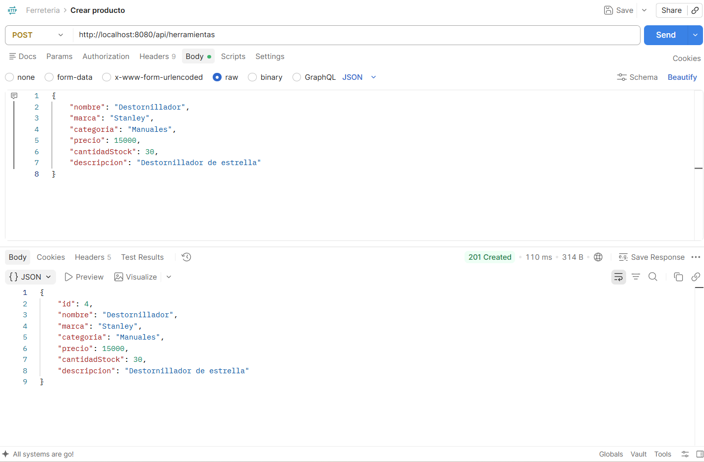
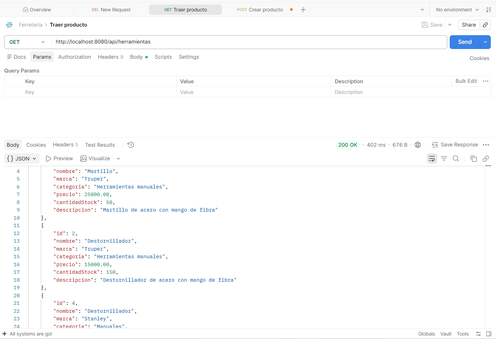
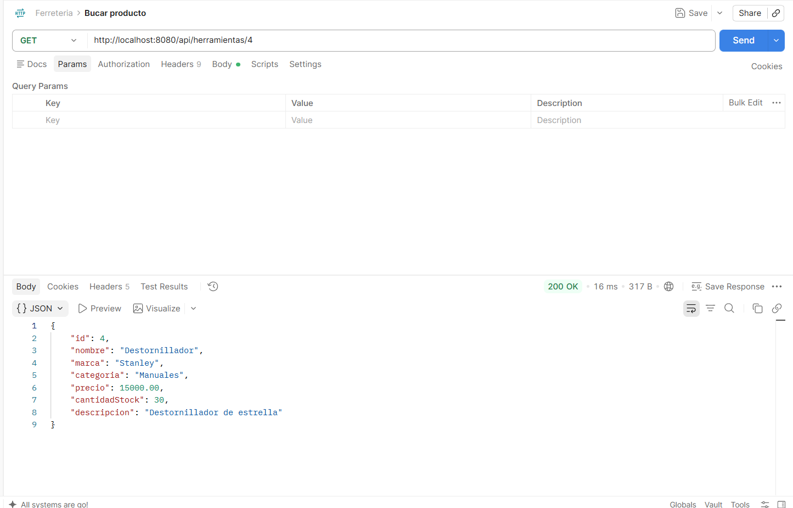
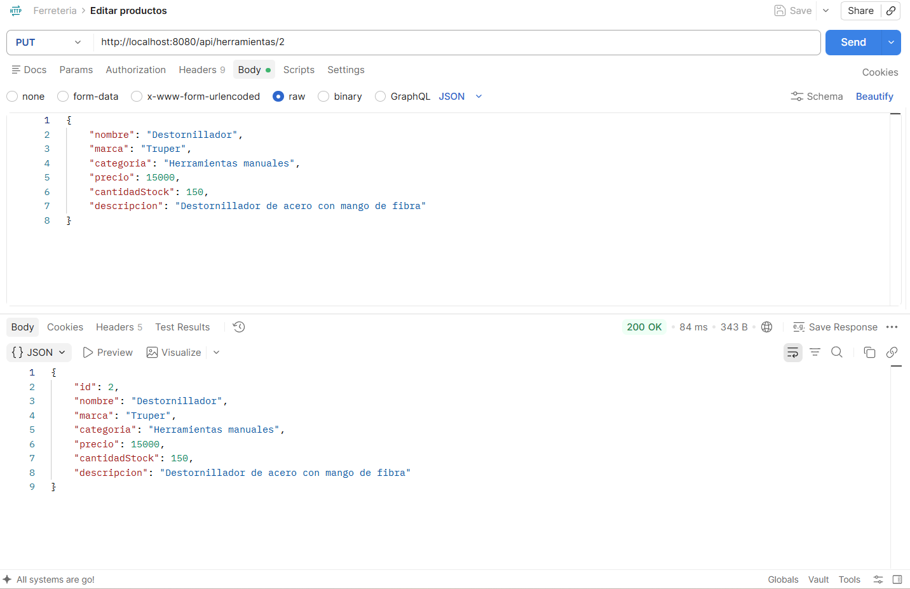
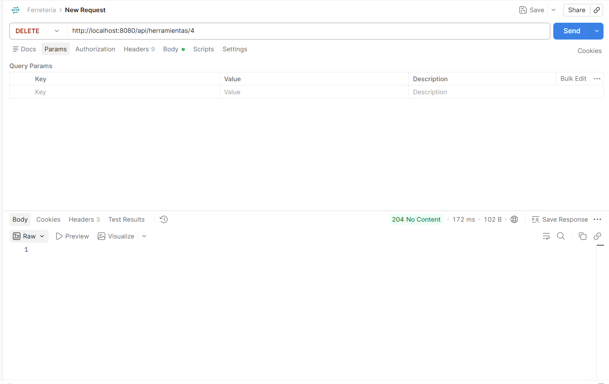

# Ferretería API - Spring Boot

API REST hecha con Spring Boot para manejar el inventario de una
ferretería (herramientas y productos). La hice como práctica para una prueba 
técnica que encontré, con el objetivo de reforzar Spring Boot, JPA y 
bases de datos relacionales.

## De qué se trata

Una ferretería necesita administrar sus herramientas mediante una API,
pensando en que más adelante se pueda conectar un frontend aparte. La API permite crear,
ver, actualizar y eliminar herramientas del inventario (CRUD completo).

## Tecnologías

- Java 24
- Spring Boot 4.1.0
- Spring Data JPA
- PostgreSQL
- Docker (para la base de datos)
- Maven
- Bean Validation
- Postman para probar los endpoints

## Arquitectura

Usé la arquitectura en capas de Spring Boot:

Controller -> Service -> Repository -> Base de datos

El Controller recibe las peticiones HTTP, el Service tiene la lógica y las validaciones, el Repository se conecta con la base de datos usando JPA, y el modelo es la clase Herramienta que representa la tabla.

## Modelo

La entidad Herramienta tiene estos campos:

- id (se genera solo)
- nombre
- marca
- categoria
- precio
- cantidadStock
- descripcion

## Endpoints

- POST /api/herramientas - crea una herramienta
- GET /api/herramientas - lista todas
- GET /api/herramientas/{id} - trae una por id
- PUT /api/herramientas/{id} - actualiza una
- DELETE /api/herramientas/{id} - elimina una

Ejemplo de lo que se manda en el body para crear o actualizar:

```json
{
    "nombre": "Martillo",
    "marca": "Truper",
    "categoria": "Herramientas manuales",
    "precio": 25000,
    "cantidadStock": 50,
    "descripcion": "Martillo de acero con mango de fibra"
}
```

Tiene algunas validaciones: el nombre, marca, categoría y descripción no pueden ir vacíos, el precio tiene que ser mayor a 0, y el stock no puede ser negativo. Si mandas algo mal, la API responde 400 con el error.

## Pruebas en Postman

Crear herramienta:


Listar todas:


Buscar por id:


Actualizar:


Eliminar:


## Cómo correrlo

Necesitas Java 24, Maven y Docker (para la base de datos).

1. Clona el repo:
```bash
git clone https://github.com/Fabio124/ferreteria-api-spring-boot
cd ferreteria-api-spring-boot
```

2. Levanta PostgreSQL con Docker y crea una base de datos llamada ferreteria_db.

3. Revisa que el application.properties tenga la conexión bien puesta:
   spring.datasource.url=jdbc:postgresql://localhost:5432/ferreteria_db
   spring.datasource.username=admin
   spring.datasource.password=admin123
(son credenciales de desarrollo local, solo para probar el proyecto)

4. Corre la aplicación:
```bash
./mvnw spring-boot:run
```

5. Queda corriendo en http://localhost:8080/api/herramientas

## Notas

La tabla se crea sola cuando corres la app por primera vez, gracias a Hibernate (ddl-auto=update).

No usé Lombok en las clases principales, escribí los getters, setters y constructores a mano para entender mejor cómo funciona antes de automatizarlo con librerías.

## Autor

Fabio Castillo Barrera

GitHub: https://github.com/Fabio124
LinkedIn: https://linkedin.com/in/fabio-castillo-barrera-65839196/